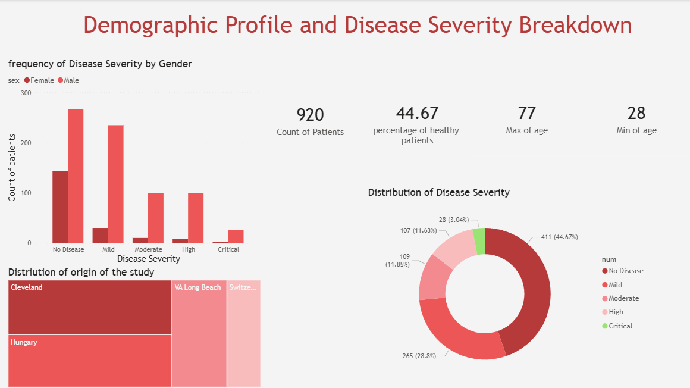
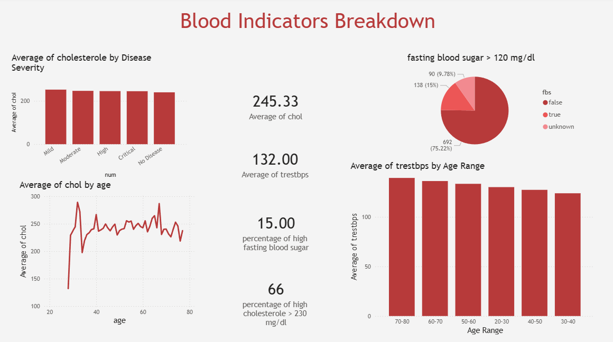
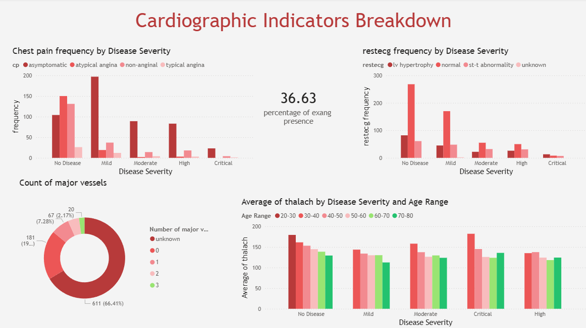

# ❤️ Heart Disease Data Analysis

## 📊 Project Overview

This project analyzes a heart disease dataset to explore patterns, distributions, and relationships between patient features and disease severity. The goal is to provide insights into which factors are associated with heart disease without using machine learning models.

## 🗂 Dataset

- 920 patient records
- 16 features including age, sex, chest pain type, blood pressure, cholesterol, maximum heart rate, and others
- Target variable: `num` (heart disease severity from 0 to 4)
- Missing values and data inconsistencies were identified and handled

## 🛠 Tools & Libraries

- Python 3.x
- Pandas 🐼
- NumPy 🔢
- Matplotlib 📈
- Power BI 📊 (for enhanced visualizations)

## 🔍 Analysis Workflow

1. **Data Exploration (EDA)**

   - Checked data types, missing values, and descriptive statistics
   - Explored univariate distributions for each feature

2. **Data Cleaning**

   - Handled outliers (e.g., corrected `oldpeak` values)
   - Fixed invalid entries (e.g., zero cholesterol values)
   - Standardized categorical variables

3. **Visualization & Bivariate Analysis**
   - Numeric vs `num`: boxplots for age, trestbps, chol, thalach, oldpeak
   - Categorical vs `num`: grouped bar charts for sex, cp, fbs, restecg, exang, slope, ca, thal
   - Key observations highlighted for each feature

## 📸 Visualizations

### Page 1 – Demographics

### Page 2 – Blood-related Clinical Data

### Page 3 – Cardiology & Heart Function

## 💻 Power BI Dashboard

A Power BI dashboard was created to provide interactive visualizations for better exploration of relationships between features and disease severity. It includes:

- Demographic distributions (age, sex, origin)
- Blood test indicators (cholesterol, fasting blood sugar)
- Cardiology measurements (thalach, slope, ca, thal, oldpeak)
- Disease severity segmentation (num 0–4, renamed as No Disease → Critical)

The dashboard allows filtering by feature and severity, offering a clear visual story for non-technical audiences.

## 📌 Key Findings

- **Age:** Most patients are between 50–60 years; median increases slightly with disease severity
- **Sex:** Males are overrepresented; higher disease prevalence in males
- **Chest Pain (cp):** Asymptomatic type occurs frequently across all disease levels, limiting predictive value
- **Blood Pressure (trestbps) & Cholesterol (chol):** Distributions overlap across disease classes; limited predictive value
- **Maximum Heart Rate (thalach):** Slight decrease with higher disease severity; moderate indicator
- **ST Depression (oldpeak):** Increases with disease severity; meaningful indicator
- **Other features (slope, ca, thal, restecg, exang, fbs):** Some categorical features provide moderate insights; missing/unknown values may limit conclusions

## 💡 Insights

- Features like **oldpeak, restecg, and thalach** show stronger association with disease severity
- Features with overlapping distributions (trestbps, chol) are less discriminative
- Handling missing values and data inconsistencies is crucial for reliable analysis

## 🚀 How to Use

1. Clone the repository
2. Open the Jupyter Notebook `heart_disease_analysis.ipynb`
3. Run the cells to explore data and visualizations
4. Review interpretations and charts for insights
5. Open the Power BI dashboard (`Heart_Disease_Dashboard.pbix`) to interact with the data visually
